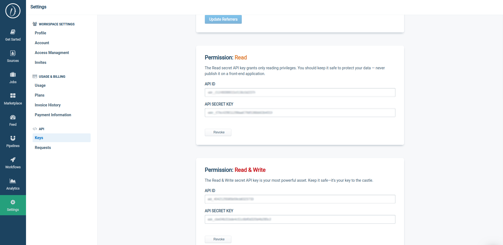

### Hrflow API PHP
🐘 Hrflow API PHP Wrapper

-------------
## Installation with composer

```
composer require hrflow/hrflow-php-api
```

## Authentication

To authenticate against the api, get your API SECRET KEY from your hrflow
dashboard:


Then create a new `Hrflow` object with this key:
```php
require __DIR__ . '/vendor/autoload.php';

// Authentication to api
$client = new Client('yourShinyKey');

// Now, you can use the api, Congrats !

```

## API Overview

```php
require __DIR__ . '/vendor/autoload.php';

// Authentication to api
$client = new Client('yourShinyKey');

$profile = $client->profile->get(new ProfileID('102b6aa635fnf8ar70e7888ee63c0jde0c753dtg'));
$name = $profile['name'];
$profile_id = $profile['profile_id'];

echo "Profile '$profile_id' is named '$name', a beautiful name actually";
```
# Errors
If an error occurs while an operation an exception of type `HrflowApiException` is raised.

# Profile the ID or the reference
Methods that needs an profile id or reference takes a `ProfileID` or a `ProfileReference`, they are interchangeable.
```php
$profile_id = new ProfileID('102b6aa635fnf8ar70e7888ee63c0jde0c753dtg');
$profile_reference = new ProfileReference('reference01');
$source_id = '34566aa635fnrtar70e7568ee6345jde0c75ert4';
// This:
$client->profile->get($profile_id, $source_id);
// Works as much as:
$client->profile->get($profile_reference, $source_id);
```

# Filter the ID or the reference
It's works the same way as profile.

## Methods & Resources
  `*_id` and `*_reference` are marked as `*_ident` for simplicity.

* # filters
  * Get all filters for given team account :
  ```php
  $client->filter->list();
  ```
  * Get the filter information associated with filter id :
  ```php
  $client->filter->get($job_ident);
  ```
* # Profiles
  * Retrieve the profiles information associated with some source ids :
  ```php
  $start = new DateTime('2017-01-02');
  $end = new DateTime();
  $args = [
      HrflowField::SOURCE_IDS => ['34566aa635fnrtar70e7568ee6345jde0c75ert4'],
      HrflowField::DATE_START => $start->getTimestamp(),
      HrflowField::DATE_END => $end->getTimestamp(),
      HrflowField::SORT_BY => HrflowSortBy::RANKING,
      HrflowField::FILTER_REFERENCE => 'reference01'
  ];
  $client->profile->list($args);
  ```
  * Add a resume to a sourced id :
  ```php
  $client->profile->add($source_id, $file_path, [$profile_reference, $timestamp_reception, $training_metadata]);
  ```
  * Add all resume from a directory to a sourced id, use `$recurs` to enable recursive mode :
  ```php
  $client->profile->addList($source_id, $file_path, [$is_recurs, $timestamp_reception, $training_metadata]);
  ```
  It returns an array like: `result[filename] = server_reponse`.
  Can throw `RiminderApiProfileUploadException`
  * Get the profile information associated with both profile id and source id :
  ```php
  $client->profile->get($profile_ident, $source_id);
  ```
  * Retrieve the profile documents associated with both profile id and source id :
  ```php
  $client->profile->document->list($profile_ident, $source_id);
  ```
  * Retrieve the profile parsing data associated with both profile id and source id :
   ```php
   $client->profile->parsing->get($profile_ident, $source_ident);
   ```
  * Retrieve the profile scoring data associated with both profile id and source id :
   ```php
   $client->profile->scoring->list($profile_ident, $source_id);
   ```
  * Reveal the profile interpretability data associated with both profile id and source id related with the filter :
    ```php
    $client->profile->revealing->get($profile_ident, $job_ident, $source_id);
    ```
  * Edit the profile stage of given a filter :
  ```php
  $client->profile->stage->set($profile_ident, $source_id, $job_ident, $rating);
  ```
  * Edit the profile rating of given a filter :
  ```php
  $client->profile->rating->set($profile_ident, $source_id, $job_ident, $rating)
  ```
  * Check if a parsed profile is valid
  ```php
  $client->profile->json->check($profileData, $trainingMetadata);
  ```
  * Add a parsed profile to the platform
  ```php
  $client->profile->json->add($source_id, $profileData, $trainingMetadata, $profile_reference, $timestamp_reception);
  ```

  `$profileData` is an array like this:
  ```php
  $profileData = [
      "name" => "test persona",
      "email" => "someone@someonelse.com",
      "address" => "1 rue de somexhereelse",
      "experiences" => [
        [
          "start" => "15/02/2018",
          "end" => "1/06/2018",
          "title" => "PDG",
          "company" => "red apple corp",
          "location" => "Paris",
          "description" => "Doing IT integration and RPA"
        ]
      ],
      "educations" => [
        [
          "start" => "2000",
          "end" => "2018",
          "title" => "Diplome d'ingénieur",
          "school" => "UTT",
          "description" => "Management des systèmes d'information",
          "location" => "Mars"
        ]
      ],
      "skills" => [
        "manual skill",
        "Creative spirit",
        "Writing skills",
        "World domination",
        "Project management",
        "French",
        "Italian",
        "Korean",
        "English",
        "Accounting",
        "Human resources"
      ]
    ];
  ```

  `$trainingMetadata` is a array of array like this:
  ```php
  $trainingMetadata = [
          [
            "filter_reference"  => "reference0",
            "stage"             => None,
            "stage_timestamp"   => None,
            "rating"            => 2,
            "rating_timestamp"  => 1530607434
          ],
          [
            "filter_reference" => "reference1",
            "stage"            => None,
            "stage_timestamp"  => None,
            "rating"           => 2,
            "rating_timestamp" => 1530607434
          ]
        ];
  ```
* # Sources
  * Get all sources for given team account:
  ```php
  $client->source->list();
  ```
  * Get the source information associated with source id:
   ```php
   $client->source->get($source_id);
   ```
* # webhooks
This package supplies webhooks support as well.
  * Check for webhooks integration:
  ```php
  $client->webhooks->check();
  ```
  * Set an handler for an event (listed with HrflowEvents constants)
  ```php
  $client->webhooks->setHandler($eventName, $callback);
  ```
  * Check if the event has an handler
  ```php
  $client->webhooks->isHandlerPresent($eventName);
  ```
  * Remove handler for an event
  ```php
  $client->webhooks->removeHandler($eventName);
  ```
  * Handle the incoming webhooks request, you need to put as argument HTTP_RIMINDER_SIGNATURE as an argument.
  ```php
  $client->webhooks->handle($encoded_datas);
  ```
  * Example on how to handle webhooks

    ```php
  	$client = new Client('api_key', 'webhook_key');

  	// Set an handler for webhooks event.
    // Event name argument is actually not mandatory
  	$callback = function($webhook_data, $event_name) {
      print($event_name);
      var_dump($webhook_data);
      }
      // HrflowEvents contants can be use as well as string for event name
      // for example here HrflowEvents::PROFILE_PARSE_SUCCESS can be replaced
      // by 'profile.parse.success'
  	$client->webhooks->setHandler(HrflowEvents::PROFILE_PARSE_SUCCESS, $callback);

  	// Get the header of the request sent by the webhook.
  	$encoded_header = [HTTP-RIMINDER-SIGNATURE => 'some encoded datas'];

      // Handle the webhook
  	$client->webhooks->handle($encoded_header);
    ```
* # Constants
  * `HrflowFields` Contains to fill profile's `args` array for /profiles constants.
  * `RiminderStage`  Contains profile stage constants.
  * `HrflowSortBy`  Contains sorting options constants.
  * `RiminderOrderBy`  Contains order options constants.
  * `RiminderSeniority`  Contains profile seniority constants.
  * `RiminderTraining_metadata`  Contain metadata fields for profile adding constants.
  * `HrflowEvents` Constains event name for webhooks
* # Exception
  * `HrflowApiException` parent of all thrown exception. Thrown when an error occurs.
  * `HrflowApiResponseException` thrown when response http code is not a valid one.
    * `getHttpCode()` to get the http code of the response.
    * `getHttpMessage()` to get the reason of response error.
  * `HrflowApiArgumentException` thrown when an invalid argument is pass to a method
  * `RiminderApiProfileUploadException` thrown when an error occurs during file upload.
    * `getFailedFiles()` to get not sended files list.
    * `getFailedFilesWithTheirExp()` to get not sended files with their exception (like: `exception_occured_during_tranfert = failed_file_list[filename]`)
    * `getSuccefullySendedFiles()` to get successfuly sended files with their response from server (like: `server_reponse_for_sucessful_upload = sucess_file_list[filename]`)

For details about method's arguments and return values see [api's documentation](https://developers.riminder.net/v1.0/reference#source)
